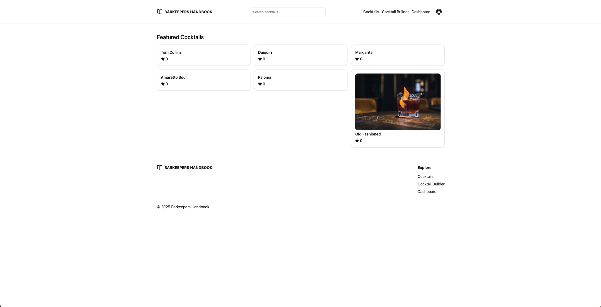

<!-- Table of Contents -->

# Table of Contents

- [About the Project](#about-the-project)
  - [Tech Stack](#tech-stack)
  - [Features](#features)
- [Roadmap](#roadmap)
- [Contact](#contact)

<!-- About the Project -->

## About the Project

 
  

Live Site URL: [barkeepershandbook.com](barkeepershandbook.com)

<!-- TechStack -->

### Tech Stack

  
Client

  <ul>
    <li><a href="https://tanstack.com/start/latest">Tanstack Start</a></li>
    <li><a href="https://www.typescriptlang.org">TypeScript</a></li>
    <li><a href="https://reactjs.org/">React.js</a></li>
    <li><a href="https://tailwindcss.com/">TailwindCSS</a></li>
    <li><a href="https://ui.shadcn.com">shadcn</a></li>
    <li><a href="https://motion.dev">Framer Motion</a></li>
    <li><a href="https://zod.dev">Zod</a></li>
    <li><a href="https://clerk.com">Clerk</a></li>
  </ul>

  
Server

  <ul>
      <li><a href="https://github.com/baileyfrye1/barkeepers-handbook-api?tab=readme-ov-file#tech-stack">C# Backend</a></li>
  </ul>

<!-- Features -->

### Features

- **Cocktail Search & Filtering**  
  Browse and filter a catalog of cocktails by name, ingredients, or category.

- **Cocktail Detail Pages**  
  View full recipes, instructions, and ingredient breakdowns.

- **Ratings Interface**  
  Leave 1–5 star ratings with a responsive UI and update/delete options.

- **User Authentication**  
  Sign up, log in, and access personalized features.

- **Responsive UI**  
 Mobile-friendly design, including responsive components based on screen size.
<!-- Roadmap -->

## Roadmap

- [ ] Add cocktail builder page for users to see what cocktails they can make
- [ ] Add profiles page so users can update their information
- [ ] Build out user dashboard
- [ ] Add filtering to all cocktails page
- [ ] Add favorites functionality and allow users to see and delete in My Activity page
- [ ] Add comments functionality and allow users to edit and delete
- [ ] Add cocktail variants functionality
- [ ] Allow users to create and store ingredients in a custom "bar"
- [ ] Add cocktail creation functionality for authenticated users
- [ ] Update design of site to have more character
- [ ] Add dark mode

## Contact

Bailey Frye - baileyafrye@comcast.net
